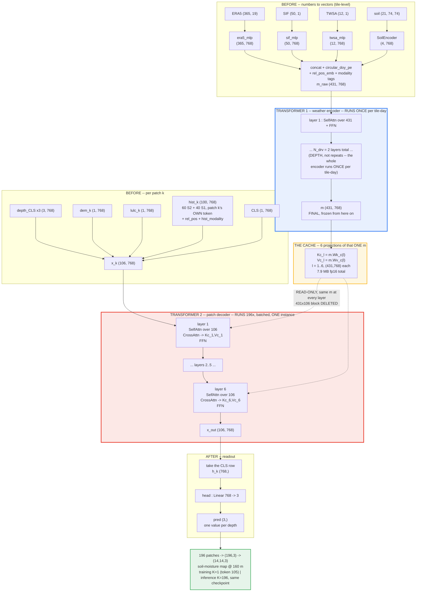

# The patchwise processor — the maths from first principles

**Status:** written 2026-08-26, session 32, branch `feat/patchwise-temporal`.
**Purpose:** to make the §35.14–§35.17 decision checkable rather than assertable. Everything here is
elementary; nothing is skipped. The build plan that follows from it is §35.18 of
`text/training_runbook.md`.

The question this document answers:

> Each 160 m patch needs its own prediction. Every patch on a tile is handed the *same* weather.
> Do we let each patch's transformer sequence carry its own copy of that weather (**concat**), or do
> we compute the weather once and let all patches *read* it (**memory**)?

---

## 0. Vocabulary

| term | meaning here |
|---|---|
| **token** | one vector of length `d = 768`. One acquisition, one ERA5 day, one static map — each becomes one token. |
| **sequence** | an ordered stack of `n` tokens, shape `(n, d)`. The transformer's input. |
| **patch** | one 160 m x 160 m cell. A tile is 2240 m across = 14 x 14 = **196 patches**. |
| **tile-day** | one station's tile on one target date. The unit of prediction. |
| **residual stream** | the `(n, d)` tensor that every layer reads from and adds back into. |
| **tile-level / tile-constant** | identical for all 196 patches on that tile-day (ERA5, SIF, TWSA, soil). |
| **patch-specific** | different per patch (that patch's satellite history, its DEM token, its LULC token). |

---

## 1. Attention from scratch

### 1.1 One head, with every dimension

Let `X` be a sequence of `n` tokens of width `d`. One attention head of width `dh`:

```
X          (n, d)          the input tokens

Wq_j       (d, dh)         query  weights for head j     LEARNED
Wk_j       (d, dh)         key    weights for head j     LEARNED
Wv_j       (d, dh)         value  weights for head j     LEARNED

Q_j = X · Wq_j             (n, dh)    "what each token is looking for"
K_j = X · Wk_j             (n, dh)    "what each token advertises about itself"
V_j = X · Wv_j             (n, dh)    "what each token hands over when read"

S_j = Q_j · K_jᵀ / sqrt(dh)          (n, n)    match score, every token vs every token
A_j = softmax(S_j, dim=-1)           (n, n)    each ROW sums to 1 — a read mixture
H_j = A_j · V_j                      (n, dh)   each token's readout
```

Row `i` of `A_j` says: *"to build token i's readout, take this much of token 1, this much of token
2, ..."*. The weights are non-negative and sum to 1.

### 1.2 A fully worked numeric example

Take `d = 2`, `dh = 2`, one head, `n = 3` tokens. Let `Wq = Wk = I` (identity) and
`Wv = [[1,0],[0,2]]`, so the arithmetic stays visible.

```
X  = [ [1, 0],        token 1
       [0, 1],        token 2
       [1, 1] ]       token 3          shape (3, 2)

Q = X·Wq = X          (3, 2)
K = X·Wk = X          (3, 2)
V = X·Wv = [ [1, 0],
             [0, 2],
             [1, 2] ] (3, 2)
```

Scores, `S = Q·Kᵀ` then divided by `sqrt(2) = 1.414`:

```
Q·Kᵀ = [ [1, 0, 1],           row 1: token1 vs tokens 1,2,3
         [0, 1, 1],           row 2
         [1, 1, 2] ]          row 3            shape (3, 3)

S    = [ [0.707, 0.000, 0.707],
         [0.000, 0.707, 0.707],
         [0.707, 0.707, 1.414] ]
```

Softmax each row (`exp(0.707) = 2.028`, `exp(0) = 1`, `exp(1.414) = 4.113`):

```
row 1: [2.028, 1.000, 2.028] / 5.056 = [0.401, 0.198, 0.401]
row 2: [1.000, 2.028, 2.028] / 5.056 = [0.198, 0.401, 0.401]
row 3: [2.028, 2.028, 4.113] / 8.169 = [0.248, 0.248, 0.503]

A = [ [0.401, 0.198, 0.401],
      [0.198, 0.401, 0.401],
      [0.248, 0.248, 0.503] ]        (3, 3), every row sums to 1
```

Readouts, `H = A·V`:

```
H row 1 = 0.401·[1,0] + 0.198·[0,2] + 0.401·[1,2] = [0.802, 1.198]
H row 2 = 0.198·[1,0] + 0.401·[0,2] + 0.401·[1,2] = [0.599, 1.604]
H row 3 = 0.248·[1,0] + 0.248·[0,2] + 0.503·[1,2] = [0.751, 1.502]

H  (3, 2)
```

That is the whole mechanism. Everything below is this, at `d = 768` with 12 heads.

### 1.3 Multi-head, and what `Wo` is

Real layers run `h = 12` heads in parallel, each of width `dh = 64`, so `d = h · dh = 768`:

```
H = [ H_1 | H_2 | ... | H_12 ]        (n, 12·64) = (n, 768)
Wo                                     (d, d) = (768, 768)     LEARNED
Attn(X) = H · Wo                       (n, d)
```

**Why `Wo` must exist — worked at d = 4, h = 2, dh = 2.**

Each head emits `dh = 2` numbers. Stack them:

```
H_1 = [a1, a2]                  head 1's output
H_2 = [b1, b2]                  head 2's output
concat = [a1, a2, b1, b2]       (4,)
```

Look at *where* those numbers sit. `a1, a2` occupy dimensions 0–1; `b1, b2` occupy 2–3. And the
block's output is added straight back into the residual stream (`X + Attn(X)`). So with no mixing
step, **head 1 could only ever influence dimensions 0–1 and head 2 only dimensions 2–3, permanently,
for the entire network.** That is a hard structural constraint with no basis in the data.

`Wo` removes it. With `concat = [1, 2, 3, 4]`:

```
out = concat · Wo                out[j] = sum_i concat[i] · Wo[i, j]

Wo = [ [1, 0, 1, 0],      row i says where input dim i is allowed to go
       [0, 1, 0, 1],
       [1, 0, 0, 0],
       [0, 1, 0, 0] ]

out[0] = 1·1 + 3·1 = 4           <- draws on head 1 AND head 2
out[1] = 2·1 + 4·1 = 6           <- same
out[2] = 1·1         = 1
out[3] = 2·1         = 2

out = [4, 6, 1, 2]
```

If `Wo` were the identity you would get `[1, 2, 3, 4]` straight back — every head locked in its own
lane. With `Wo` learned, any output dimension can draw on any head at any strength, including zero.

So the four matrices divide the work like this:

```
Wq, Wk, Wv     turn tokens into queries / keys / values             BEFORE attention
Wo             turn h stacked head-outputs back into one vector
               expressed in the residual stream's own basis          AFTER attention
```

**Why this matters for our design.** `Wo` acts on the attention *output*, which differs for every
patch — that is the point of the layer. So `Wo` can never be cached, and the four projections split
cleanly by which side they touch:

```
Wk_c, Wv_c     act on m    (M = 431 rows, no k)   ->  CACHED, computed once per tile-day
Wq_c, Wo_c     act on x_k  (L = 106 rows, has k)  ->  run per patch, 196 times
```

That split is exactly the `2 · 106 · 768²` per patch versus `2 · 431 · 768²` once, in §6.

In PyTorch: `Wq, Wk, Wv` are stored packed as `in_proj_weight` (shape `(3d, d)`) and `Wo` is
`out_proj`. That packing is why `train.py:463` matches `endswith("bias")` rather than `".bias"`.

### 1.4 The complete layer

```
LN(X)                              (n, d)     LayerNorm, applied PER TOKEN
X1 = X + Attn(LN(X))               (n, d)     attention sub-block, residual

W1                                 (d, 4d)  = (768, 3072)     LEARNED
W2                                 (4d, d)  = (3072, 768)     LEARNED
FFN(Z) = GELU(Z · W1) · W2         (n, d)
X2 = X1 + FFN(LN(X1))              (n, d)     feed-forward sub-block, residual
```

This repo uses `norm_first=True` (`model.py:411-416`), i.e. exactly the pre-norm form above, with
`N = 6` layers.

### 1.5 Cost of one layer — and the fact everything hinges on

Counting multiply-adds, where `(a,b)x(b,c)` costs `a·b·c`:

```
Wq, Wk, Wv, Wo    4 · n · d²
FFN W1, W2        2 · n · d · 4d   =   8 · n · d²
                  -------------------------------
LINEAR total                           12 · n · d²      grows LINEARLY   in n
ATTENTION         Q·Kᵀ and A·V     =    2 · n² · d       grows QUADRATICALLY in n
```

At `n = 537`, `d = 768`:

```
linear      12 · 537 · 768²  =  3.80e9      ~90%
attention    2 · 537² · 768  =  0.44e9      ~10%
```

**The linear term dominates.** This is why §34.7 and `open_items.md` §G2 reached wrong conclusions —
both counted *attention pairs* and ignored that the projections and the FFN scale with `n`. Any cost
argument in this project that quotes an attention-pair ratio should be re-derived.

---

## 2. Our data, dimensioned

### 2.1 The grid

```
tile                 2240 m x 2240 m           224 x 224 pixels at 10 m
TerraMind patch      16 x 16 px = 160 m
token grid           14 x 14 = 196 patches     P = 196
station token        index 105 = (112//16)·14 + (112//16) = 7·14 + 7      dataset.py:74
```

Note 105 is a *token* index; 112 is a *pixel* coordinate. Both appear in the codebase and they are
not the same thing.

### 2.2 Patch-specific tokens `x_k` — these carry the index k

```
x_k                          (L, d) = (106, 768)

  depth_CLS      (3,   768)   three learned tokens, one per SM depth (0-10, 10-30, 30-100 cm)
  dem_k          (1,   768)   TerraMind L12 token for patch k of the DEM
  lulc_k         (1,   768)   TerraMind L12 token for patch k of the land cover map
  hist_k         (100, 768)   60 S2 + 40 S1 acquisitions; patch k's OWN token from each
                              (MAX_S2 = 60, MAX_S1 = 40, dataset.py:75-76)
  CLS            (1,   768)   learned readout token — its final state IS patch k's prediction
                              ------
                              L = 106
```

Each history token additionally receives `rel_pos_emb(staleness)` and `hist_modality_emb(S2 or S1)`,
exactly as the current model does (`model.py:577-601`).

### 2.3 Tile-level driver tokens `m` — these carry NO index k

```
m                            (M, d) = (431, 768)

  era5   (365, 768)    era5_mlp:    (365, 19)    -> (365, 768)     one token per day, 365-day window
  sif    (50,  768)    sif_mlp:     (50,  1)     -> (50,  768)     MAX_SIF  = 50
  twsa   (12,  768)    twsa_mlp:    (12,  1)     -> (12,  768)     MAX_TWSA = 12
  soil   (4,   768)    SoilEncoder: (21, 74, 74) -> (4,   768)
                       ---------
                       M = 431
```

Each also receives `circular_doy_pe(absolute DOY)` — the seasonal clock — and
`rel_pos_emb(staleness)` — the recency clock. SIF and TWSA are sparse, so their `rel_pos` comes from
the real observation date per slot, not the slot index.

Concatenated: `T = L + M = 106 + 431 = 537`.

### 2.4 Why `m` has no `k` — this is a fact about the data, not a modelling choice

```
ERA5 grid cell          ~9000 m
tile                     2240 m
                        ---------
one ERA5 cell covers the entire tile, with room to spare
```

So on a given target day, all 196 patches are handed the **byte-identical** 365x19 ERA5 array. Same
for SIF (~7 x 3.5 km) and TWSA (~300 km). Written out:

```
m  is a function of (station, target_date)          -- no k
x_k is a function of (station, target_date, k)      -- has k
```

**Immediate consequence.** If patch A is wetter than patch B on day D, `m` cannot be the reason —
it is the same number for both. Every bit of within-tile pattern must come from `x_k`. The drivers
set the tile's *level* and its *dynamics*; they cannot set its *pattern*. That is the entire reason
§34/§35 exist.

---

## 3. Design A — concat

### 3.1 The sequence

```
X_k = [ x_k ; m ]                (T, d) = (537, 768)     one sequence PER PATCH
```

All 537 tokens go into one self-attention stack, `N = 6` layers.

### 3.2 Block structure of the projections

```
Q_k = X_k · Wq       (537, 768)      rows   0..105  =  x_k · Wq     (106, 768)   has k
                                     rows 106..536  =  m   · Wq     (431, 768)   NO k

K_k = X_k · Wk       (537, 768)      bottom 431 rows = m · Wk                    NO k
V_k = X_k · Wv       (537, 768)      bottom 431 rows = m · Wv                    NO k
```

**There is the duplication, stated exactly:** `m·Wk` and `m·Wv` are computed once per patch and
return 196 bit-identical results.

```
wasted multiply-adds per layer  =  2 · 431 · 768² · 196  =  1.0e11
```

### 3.3 Block structure of the attention

```
S_k  (537, 537)

     |  (106, 106)   patch reads patch      |  (106, 431)   patch reads weather   |
     |  (431, 106)   WEATHER READS PATCH    |  (431, 431)   weather reads weather |
```

The top-right block is the one we want: a patch reading the weather. The bottom-left block is the
one that causes all the trouble.

### 3.4 Why the duplication cannot simply be cached — worked numerically

Split the attention output by row:

```
A_k · V_k                    (537, 768)
   rows   0..105   ->  updated patch tokens      (106, 768)
   rows 106..536   ->  updated weather tokens    (431, 768)   call this m_k
```

and written out:

```
m_k = softmax( [ m·Wq·(x_k·Wk)ᵀ ,  m·Wq·(m·Wk)ᵀ ] ) · [ x_k·Wv ; m·Wv ] · Wo
                 (431, 106)          (431, 431)          (106, 768)  (431, 768)
```

`m_k` depends on `k` through `x_k`. **A concrete demonstration**, `d = 2`, `Wq = Wk = Wv = Wo = I`,
attention only, one shared driver token `m = [1,1]` and two different patches:

```
patch 1:  X_1 = [ [1, 0],     <- x_1
                  [1, 1] ]    <- m

patch 2:  X_2 = [ [0, 1],     <- x_2
                  [1, 1] ]    <- m      (same m, byte-identical)
```

The `m` row of `K` is `[1,1]` in **both** — that is the redundancy at the input. Now compute what
the `m` token becomes after one layer.

```
PATCH 1:  q_m = [1,1]
  scores:  [1,1]·[1,0] = 1 ;  [1,1]·[1,1] = 2
  /sqrt(2): 0.707, 1.414
  softmax:  [2.028, 4.113] / 6.141 = [0.330, 0.670]
  V rows:   [1,0] , [1,1]
  out_m(1) = 0.330·[1,0] + 0.670·[1,1] = [1.000, 0.670]

PATCH 2:  q_m = [1,1]
  scores:  [1,1]·[0,1] = 1 ;  [1,1]·[1,1] = 2      (same scores!)
  softmax:  [0.330, 0.670]                          (same weights!)
  V rows:   [0,1] , [1,1]                           (DIFFERENT values)
  out_m(2) = 0.330·[0,1] + 0.670·[1,1] = [0.670, 1.000]
```

```
out_m(1) = [1.000, 0.670]
out_m(2) = [0.670, 1.000]        NOT EQUAL
```

The weather token entered layer 1 identical for both patches and left it **different**, because it
read the patch. So at layer 2 there is no shared `m` any more — there are 196 distinct `m_k`, and
`m_k·Wk` must be computed 196 times for real.

**This is the formal reason the design cannot be retrofitted.** The redundancy exists only at the
input; one layer of full self-attention destroys it. Choosing concat and later wanting the cache
means retraining from scratch.

---

## 4. Design B — read-only memory

### 4.1 Delete the (431, 106) block

```
x_k'   = x_k   + SelfAttn ( LN(x_k) )              (106, 768)     over the 106 only
x_k''  = x_k'  + CrossAttn( LN(x_k'), m )          (106, 768)     patch READS weather
x_k''' = x_k'' + FFN      ( LN(x_k'') )            (106, 768)
m      = m                                          (431, 768)     NEVER UPDATED
```

### 4.2 The cross-attention, dimensioned

```
Q  = LN(x_k') · Wq_c        (106, 768)     queries come from the PATCH      -- has k
Kc = m · Wk_c               (431, 768)     keys   come from the WEATHER     -- NO k
Vc = m · Wv_c               (431, 768)     values come from the WEATHER     -- NO k

S  = Q · Kcᵀ / sqrt(64)     (106, 431)     each patch token scores all 431 driver tokens
A  = softmax(S, dim=-1)     (106, 431)     rows sum to 1
Y  = A · Vc                 (106, 768)
out = Y · Wo_c              (106, 768)
```

`Kc` and `Vc` carry no `k`. Therefore compute them **once per tile-day, per layer**, and reuse:

```
cache = { (Kc_l, Vc_l) : l = 1..6 }        6 x 2 x (431, 768)
size, fp16 = 6 · 2 · 431 · 768 · 2 bytes  =  7.9 MB
```

This is **exact**, not an approximation and not a low-rank trick — it is literally the same tensor
being read 196 times instead of recomputed 196 times.

### 4.3 The driver self-encoder — it restores the (431, 431) block

The clean way to see this is against the four blocks of §3.3. The memory design deletes **exactly
one** of them:

```
106 x 106   patch <-> patch        KEEP   -> self-attention over the 106
106 x 431   patch reads weather    KEEP   -> cross-attention into the cache
431 x 106   weather reads patch    DELETE <- the entire design decision
431 x 431   weather <-> weather    KEEP   -> ??? nothing does this yet
```

Self-attention plus cross-attention alone silently loses the **fourth** block too: nothing ever lets
the driver tokens see each other, so each ERA5 day is just `era5_mlp(that day's 19 variables)` plus
position embeddings and knows nothing about the day before it. The driver self-encoder is how block
4 survives, and that is its whole justification — parity with concat on the one axis where the split
would otherwise be strictly weaker.

**Do not overstate it.** An earlier draft of this section claimed sequential structure is "not
expressible" without it. That is too strong: the patch gets 6 rounds of cross-attention with 12
heads each, and a query scoring jointly on magnitude and recency can already approximate things like
"the most recent heavy rain". What is genuinely missing is that the *driver representation itself*
is never contextualised, so anything requiring days to have combined non-linearly before being read
must be rebuilt by the patch through repeated weighted sums. At 0.6% of the cost this is insurance
worth buying, not a proven necessity.

One real difference from concat: there, block 4 is recomputed at every layer on patch-contaminated
values; here it is computed once, up front. Same role, not identical.

**DECIDED (user, 2026-08-26): `N_drv = 2` layers** (`--driver-layers`, §35.19). `N_drv` is a
**depth, not a repeat count** — the encoder runs **once per tile-day** whatever its depth. Two and
not six because depth here processes only *tile-constant* weather, and six would take the model to
103.9 M (2.1x the 50.35 M baseline), confounding capacity with architecture. Measured totals:
memory/6/2 = 75.53 M, concat/6/2 = 61.34 M, memory/4/2 = 56.62 M. A 4-layer capacity-parity
variant is deferred to ablation:

```
m_raw  (431, 768)  ->  driver_encoder  ->  m  (431, 768)
cost:  2 layers · (12 · 431 · 768² + 2 · 431² · 768)  =  6.7e9 multiply-adds
```

Against ~1.1e12 for the patch stack, this is free.

### 4.4 The implementation trap

Do **not** write this with stock `nn.MultiheadAttention(q, k, v)` and `m.expand(196, 431, 768)`.
`nn.MultiheadAttention` runs `in_proj` on whatever it is handed, so it would re-project the same 431
tokens 196 times and give back every bit of the duplication. The block needs explicit `q_proj`,
`k_proj`, `v_proj`, `o_proj` with `F.scaled_dot_product_attention`, and the `k_proj`/`v_proj` calls
lifted out of the per-patch loop.

### 4.5 The complete flow — it is TWO transformers

The design is the classic **encoder--decoder** shape (Vaswani et al.): one transformer reads the
source once, a second transformer cross-attends into its frozen output at every layer. Swap "source
sentence" for "the tile's weather" and "target sentence" for "this patch" and it is the same
machine. Two differences from a translation model: **no causal mask** (a patch's 106 tokens are a
set, not generated left-to-right), and the output is a **regression** (one CLS row -> 3 numbers),
not a vocabulary distribution.

```
TRANSFORMER 1   "weather encoder"    431 tokens    2 layers    runs   1x per tile-day
TRANSFORMER 2   "patch decoder"      106 tokens    6 layers    runs 196x (batched)
                reads transformer 1's final output as a fixed memory

concat  =  ONE transformer over 537 tokens, run 196 times
memory  =  TWO transformers -- 431 run once, 106 run 196 times
```



Same thing in ASCII, for viewers without mermaid:

```
=========================  BEFORE : numbers -> vectors  =========================

  TILE-LEVEL                                    PER PATCH k
  ERA5 (365,19) -> era5_mlp -> (365,768)        hist_k  (100,768)  <- TerraMind, frozen
  SIF  (50,1)   -> sif_mlp  ->  (50,768)        dem_k     (1,768)  <- row k of (196,768)
  TWSA (12,1)   -> twsa_mlp ->  (12,768)        lulc_k    (1,768)  <- row k of (196,768)
  soil (21,74,74) -> SoilEncoder -> (4,768)     depth_CLS (3,768)  <- pure parameters
        + DOY + rel_pos + modality tags         CLS       (1,768)  <- pure parameter
                    |                                 + rel_pos + modality tags
                    v                                       |
            m_raw  (431,768)                                v
                                                     x_k  (106,768)

===================  INSIDE : two transformers, not one  =======================

  TRANSFORMER 1 -- weather encoder            TRANSFORMER 2 -- patch decoder
  runs ONCE per tile-day                      runs 196x (batch dim), ONE instance

    m_raw (431,768)                             x_k (106,768)
      layer 1  SelfAttn(431) + FFN                layer 1  SelfAttn(106)
      ...                                                  CrossAttn -> Kc_1,Vc_1  --,
      layer N  SelfAttn(431) + FFN                         FFN                       |
          |                                       layer 2  ... -> Kc_2,Vc_2  --------|
          v                                       ...                                |
      m (431,768)   FINAL, FROZEN                 layer 6  ... -> Kc_6,Vc_6  --------|
          |                                                |                         |
          |  six projections of the SAME m                 v                         |
          +--> Kc_1,Vc_1  Kc_2,Vc_2 ... Kc_6,Vc_6  >>> read-only, never written back -+
                        THE CACHE, 7.9 MB fp16                       |
                                                            x_out (106,768)

=========================  AFTER : vector -> numbers  ==========================

    x_out (106,768) --take the CLS row--> h_k (768,) --head--> pred (3,)  per depth
                                                                   |
                      196 patches -> (196,3) -> reshape -> (14,14,3) map @ 160 m
                      training  K=1  (token 105, one label, Huber loss)
                      inference K=196 (full map, SAME checkpoint)
```

**What runs how often — the point most easily misread:**

```
ONCE per tile-day :  build m_raw, transformer 1, the six Kc_l/Vc_l projections
SIX times         :  the LAYERS of transformer 2 (each reads a different Kc_l/Vc_l)
196 times         :  the whole of transformer 2 (as a batch)
```

Transformer 1's own depth is a *separate* count from transformer 2's six layers. `m` is computed
once and frozen; every layer of transformer 2 reads the **same** `m`. What differs per layer is only
`Wk_c(l)`, `Wv_c(l)` — six different questions asked of the same weather, not six re-encodings of
it. That is why the cache holds six entries rather than one.

Read the diagram against the four blocks of §3.3:

```
106x106   patch <-> patch        KEPT     -> transformer 2, self-attention
106x431   patch reads weather    KEPT     -> transformer 2, cross-attention
431x106   weather reads patch    DELETED  <- the entire design decision
431x431   weather <-> weather    KEPT     -> transformer 1
```

---


## 5. Batching — patches and days together

There is **one model instance**, always. The patch axis is the *batch* dimension, not a model
dimension — the same way a CNN applies one kernel at every spatial location without instantiating
one convolution per location.

```
Kc     (D, 431, 768)     ->  heads  (D, 12, 431, 64)        one cache per DAY
Q      (D, P, 106, 768)  ->  heads  (D, P, 12, 106, 64)     one query set per (day, patch)

S = einsum('dphlx,dhmx->dphlm', Q, Kc)      (D, P, 12, 106, 431)
A = softmax(S / sqrt(64), dim=-1)           (D, P, 12, 106, 431)
Y = einsum('dphlm,dhmx->dphlx', A, Vc)      (D, P, 12, 106, 64)
    reshape                                 (D, P, 106, 768)
out = Y · Wo_c                              (D, P, 106, 768)
```

Read the index letters: `d` (day) appears on **both** `Q` and `Kc`; `p` (patch) appears on **`Q`
only**. That asymmetry *is* the sharing.

**This is where a silent bug will live.** The cache is per *day*, not per patch. Get the `(D,P)`
view wrong — a stray `repeat_interleave` on the wrong axis — and every patch reads some other day's
weather. Nothing crashes; you get a mediocre model and no signal that anything is wrong. It must be
asserted in `test_patchwise_model.py`.

Readout:

```
x_final[:, :, -1, :]      (D, P, 768)       the per-patch CLS row
head:  Linear(768 -> n_depths)
pred                      (D, P, 3)         P = 196 -> reshape (D, 14, 14, 3) @ 160 m
```

**Training is the same code with P = 1** (`token_sel="station"`, patch index 105). Inference is the
same code with P = 196 and the *same checkpoint*. That is forced by weight sharing, and it is the
mechanism that makes step 1 work at all: supervising the station's single token teaches the mapping
at all 196 (§34.4).

### 5.1 Which axes parallelise, and where

| axis | width | parallelised |
|---|---|---|
| patch | 196 | batch dimension, inside the forward pass |
| day | 365 | batch dimension, inside the forward pass, alongside patches |
| station | 40 (TxSON) / 993 (all) | across SLURM array tasks and GPUs |

Days are independent **computationally** — the model is not recurrent and not autoregressive, so
day D's physical dependence on day D-1 lives inside its own 365-day backward window, not in a state
handed forward.

**Shard by station, never by day.** Not because days interact, but because consecutive days share
~99% of their history window. Sharding days across N tasks makes each task read the same station
array, N times over. Sharding by station reads each array once. `slurm/eval_predict.sh` already has
`--csv-start-idx`/`--csv-end-idx`; reuse it.

### 5.2 The real inference bottleneck is I/O, not compute

```
naive:  re-read a (100, 196, 768) fp16 history window per tile-day
        = 30 MB x 14,600 tile-days  =  ~438 GB of reads

resident: a station's ENTIRE L12 record is ~35 MB per modality (Hupsel, 117 dates)
        ~100 MB per station across S2 / S1asc / S1desc
        =  ~4 GB for all 40 TxSON tiles,  ~100 GB for all 993      (node has 720 GB)
```

So **station outer, day inner**, with the array resident (`/dev/shm` memmap path,
`dataset.py:749-765`) turns 438 GB of reads into one 4 GB read plus in-RAM slicing. Only after that
does adding GPUs help — parallelising the naive version just adds GPFS contention.

---

## 6. Cost, fully expanded

Per layer, `d = 768`, multiply-adds.

```
CONCAT, per patch:
  Wq, Wk, Wv, Wo     4 · 537 · 768²            =  1.267e9
  FFN W1, W2         8 · 537 · 768²            =  2.534e9
  Q·Kᵀ , A·V         2 · 537² · 768            =  0.443e9
                                                  -------
                                                  4.244e9    x 196 patches = 8.32e11

MEMORY, once per tile-day:
  Kc, Vc             2 · 431 · 768²            =  0.508e9

MEMORY, per patch:
  self Wq..Wo        4 · 106 · 768²            =  0.250e9
  self Q·Kᵀ, A·V     2 · 106² · 768            =  0.017e9
  cross Wq, Wo       2 · 106 · 768²            =  0.125e9      (Q and O only — K,V are cached)
  cross Q·Kcᵀ, A·Vc  2 · 106 · 431 · 768       =  0.070e9
  FFN W1, W2         8 · 106 · 768²            =  0.500e9
                                                  -------
                                                  0.963e9    x 196 patches = 1.888e11
                                                             + cache        = 1.89e11

                                          ratio  =  4.4x
```

**Where the saving actually comes from: the FFN.** Under concat the feed-forward network runs on all
537 tokens for every one of the 196 patches — `8 · 537 · d²`. Under memory it runs on 106 —
`8 · 106 · d²`. The attention terms are the small ones. Anyone re-deriving this by counting
attention pairs will get the wrong answer.

Whole tile-day, 6 layers:

```
concat   4.99e12 MAC  =  1.00e13 FLOP
memory   1.13e12 MAC  +  6.7e9 (driver encoder)  =  2.28e12 FLOP

at ~99 TFLOP/s (H100 bf16, a conservative 10% of peak):
                          0.10 s        vs        0.023 s     per tile-day
40 TxSON tiles x 365 days:  24 min       vs         5.6 min

activation memory, per layer:
  concat   196 · 537 · 768 · 2 B  =  161.6 MB
  memory   196 · 106 · 768 · 2 B  =   31.9 MB   + 7.9 MB cache
```

**Note a correction.** §35.15 quotes "12 min vs 3 min". That treated multiply-adds as FLOPs;
doubling gives the figures above. It changes nothing — **neither number binds**. This is exactly the
argument §35.14 used to kill the Perceiver resampler, and intellectual consistency requires applying
it here too: *the cost is not the reason to prefer the memory design.* The reasons are in §7 and §8.

---

## 7. What the memory design gives up

Both designs compute the same function of the same inputs:

```
pred_k = f( x_k , m )
```

`m` is an input either way, so **no information is lost**. What differs is the space of functions
`f` can be — and **neither design contains the other**:

```
concat has, memory does not:   the (431,106) block — weather reshaped by patch content
memory has, concat does not:   independent normalisation, and separate projections
```

The second half is easy to miss. Concat runs **one softmax over all 537 keys**, so a patch's own
history and the weather compete for a single probability budget — attend 90% to weather and only 10%
is left for the history. The split runs **two softmaxes**, over 106 and over 431, and sums the
results, so each is normalised independently. It also has separate `Wq/Wk/Wv` for the two, asking a
different question of history than of weather, which doubles attention parameters (4.72M vs 2.36M
per layer).

```
CONCAT, patch rows:
  out = softmax([ x·Wq·(x·Wk)ᵀ | x·Wq·(m·Wk)ᵀ ]) · [ x·Wv ; m·Wv ] · Wo
                  <-- 106 -->    <-- 431 -->        ONE budget, split between them

SPLIT:
  x = x + softmax( x·Wq_s·(x·Wk_s)ᵀ ) · (x·Wv_s) · Wo_s        softmax over 106
  x = x + softmax( x·Wq_c·(m·Wk_c)ᵀ ) · (m·Wv_c) · Wo_c        softmax over 431
                                                               TWO budgets, summed
```

**A third design exists and should be on the table.** Keep one joint softmax over 537 with shared
weights, but simply do not update `m`'s rows — "frozen-m". That *is* strictly
concat-minus-the-(431,106)-block, so the subset argument holds exactly; `Kc, Vc` remain cacheable;
and it is cheaper still (0.837e9 vs 0.963e9 per patch per layer, a **5.1x** saving over concat
rather than 4.4x), needing no new module, just a masked update. **But it does not fix dilution** —
the readout still runs one softmax over 537 keys of which 431 are constant across patches. The
separate softmax in the split form is precisely what delivers the 96%-vs-19% property in §8. The two
trade off directly against each other.

An earlier draft of this section asserted "memory-form is a strict subset of concat-form". That is
true only of the frozen-m variant, not of the split form recommended in §9.

The justification for deleting it is physical, not computational: **meteorology is exogenous**. ERA5
at 9 km is not modified by which 160 m patch is being predicted. A patch must read the weather; the
weather need not read the patch. No mechanism has ever been articulated in this project by which it
would.

---

## 8. Expressiveness vs optimisation — the argument that actually decides it

Two distinct ways a model can fail:

- **Expressiveness** — *can* it represent the right function at all?
- **Optimisation** — will gradient descent actually *find* it, with the data and epochs available?

**On expressiveness, neither dominates** (§7): concat has the `(431,106)` block, memory has
independent normalisation and separate projections. Concat's advantage is the one that matters for
this comparison — it can do something with the data that memory structurally cannot.

**On optimisation, it reverses.** At initialisation attention is roughly uniform. The per-patch CLS
reads 537 tokens, of which 431 are byte-identical across every patch on the tile:

```
concat:   patch-specific share of what the CLS attends over  =  102 / 537  =  19%
memory:   patch-specific share of the self-attention          =  102 / 106  =  96%
```

So under concat, ~80% of what the readout initially sees carries **zero information about which
patch this is**, and the optimiser must dig the distinguishing 19% out from under it. It probably
can, given enough data and epochs. The memory form simply never asks — the architecture hands over
the separation for free.

**Why that matters for this run specifically.** Step 1's question is *"does per-patch history carry
within-tile SM information at all?"* If concat trains and returns a null, these two are
indistinguishable:

```
"un-pooling genuinely does not help"                           <- the scientific answer wanted
"the optimiser never dug the signal out of an 81% background"  <- an engineering artifact
```

Eliminating exactly that class of confound is why §35.9 mandates five arms; introducing a fresh one
in the architecture would be self-defeating. With 13 four-GPU runs having never converged and §35.12
naming **calendar time** as the scarce resource, an uninterpretable null is the expensive outcome —
not the GPU hours.

The claim is **not** that concat cannot do it. It is that choosing memory removes a way the
experiment could fail for a reason unrelated to the hypothesis under test.

---

## 9. Decision

**Build both, behind `--driver-mode {memory, concat}`. Default `memory`. Train stage 2a with it.**

The FFN, norms, heads, driver encoder and the entire rest of the model are shared between the two;
only the attention wiring differs, so the second mode is ~30 lines. That converts a one-way door
(§3.4: retrofitting means retraining) into a measurement.

```
memory (default)
  self:   [ depth_CLS x3 | dem_k | lulc_k | hist_k x100 | CLS ]     106      per patch
  cross:  [ era5 365 | sif 50 | twsa 12 | soil 4 ]                  431      K/V once per tile-day

concat
          all 537 in one self-attention stack
```

**What is NOT in either design**, and will not be revisited (§35.14): the Perceiver-style resampler.
No compression of 427 -> 32 latents, no learned latent queries, no learned null token, no `-1e4`
masking. All 431 driver tokens are kept whole in both modes. The resampler was justified on a cost
ratio whose absolute magnitude does not bind, its "three separate resamplers for clean ablation"
premise was false (masking a modality's inputs already gives exact ablation, and
`dataset.py:1150-1151,1157-1158` already does exactly that on ~50% of training samples), and
deferring it to a later stage would have forced a full retrain.

---

## 10. Summary table

| | concat | memory |
|---|---|---|
| driver tokens kept whole | yes, 431 | yes, 431 |
| per-patch sequence | 537, one self-attention stack | 106 self + cross into 431 |
| weather recomputed per patch | yes, every layer | no, cached per tile-day |
| driver K/V cacheable | only at layer 1, useless | yes, all 6 layers, exact |
| cache size | - | 7.9 MB fp16 |
| cost per layer, K=196 | 8.32e11 MAC | 1.89e11 MAC (4.4x less) |
| activation memory per layer | 161.6 MB | 31.9 MB |
| full-year inference, 40 tiles | ~24 min | ~5.6 min |
| patch-specific share of readout | 19% | 96% |
| has the (431,106) block | yes | no — deleted on purpose |
| independent softmax budgets | no — one budget over 537 | yes — 106 and 431 normalised separately |
| attention params per layer | 2.36 M | 4.72 M |
| new modules needed | none | cross-attention block + driver self-encoder |
| retrofittable later | - | no — decide before training |

---

## 11. Two properties worth stating explicitly

**Depth is not a law.** `N = 6` comes from Vaswani et al. 2017, chosen empirically for WMT at their
compute budget (their Table 3 ablates N = 2, 4, 6, 8). It propagated by inheritance, not derivation.
Real models vary: BERT-base 12, BERT-large 24, ViT-Base 12 (TerraMind's own backbone — which is why
we extract L3/L6/L9/L12), T5-base 12+12, GPT-3 96. This project's `n_layers = 6` (`train.py:206`) is
itself undeirved: the width (768, 12 heads) was copied from ViT-Base and the depth halved. Depth is
set by data scale, by how many sequential reasoning steps the task needs, and by optimisation
stability — not by convention.

Settled for stage 2a: **T2 = 6 layers, T1 = 2 layers, 72.0 M.** A capacity-parity variant
(`--n-layers 4 --driver-layers 2`, 53.0 M against the 50.35 M baseline) is an **ablation, run later**.
Note the two parities are mutually exclusive: the baseline layer is `self + FFN`, ours is
`self + cross + FFN`, so equal depth means unequal parameters and vice versa.

**Everything is bidirectional. There is no causal mask anywhere.**

```
T1 weather encoder    every ERA5 day attends to every other day
T2 self-attention     all 106 tokens attend to all 106
cross-attention       every patch token reads all 431 driver tokens
```

Correct here because we are not generating a sequence — we regress one value from a fixed window.
A causal mask would only make sense if we predicted every day in the window.

**And it does not leak, because the window itself is strictly backward-looking.**
`rel_pos = 364 - (target_date - acq_date).days` (`dataset.py:89-96`), so every token in the sequence
predates the target. Attention running "forwards" inside that window still only ever sees the past.

One recorded exception, still open: §33.12's `c_k` temporal look-ahead — the S1 climatology may be
computed over the full record rather than backward-only, which *would* leak. It is a §33 decoder
issue and does not touch stage 2a, but it is not closed.
